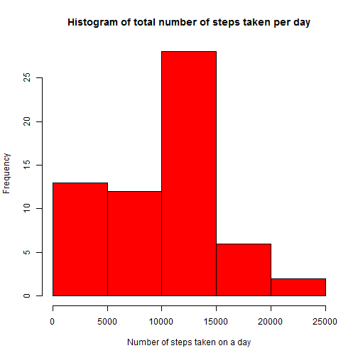
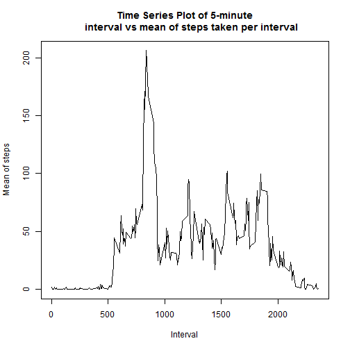
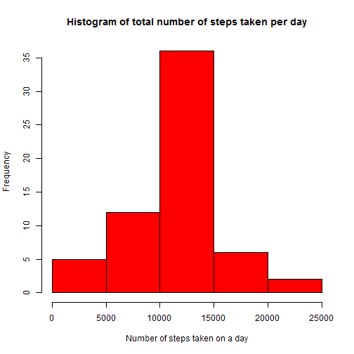
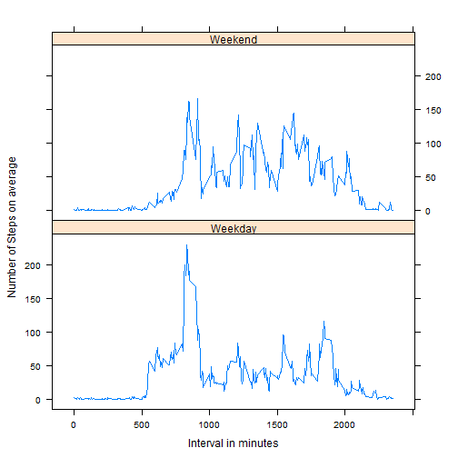

## Loading and preprocessing the data
I will have to set the system locale to English so that I don't have problems showing the days in the plots. I will also load and use the package dplyr because it makes the data.frame much easier to work with. Finally, dates in the original dataset will have to be coerced into Date types since they are read as factors originally.


```r
library(dplyr)
library(lattice)

Sys.setlocale("LC_TIME", "English")
```


```r
activity <- read.csv("activity.csv")

tbl_activity <- tbl_df(activity)

str(tbl_activity)
```

```
## Classes 'tbl_df', 'tbl' and 'data.frame':	17568 obs. of  3 variables:
##  $ steps   : int  NA NA NA NA NA NA NA NA NA NA ...
##  $ date    : Factor w/ 61 levels "2012-10-01","2012-10-02",..: 1 1 1 1 1 1 1 1 1 1 ...
##  $ interval: int  0 5 10 15 20 25 30 35 40 45 ...
```

```r
summary(tbl_activity)
```

```
##      steps                date          interval     
##  Min.   :  0.00   2012-10-01:  288   Min.   :   0.0  
##  1st Qu.:  0.00   2012-10-02:  288   1st Qu.: 588.8  
##  Median :  0.00   2012-10-03:  288   Median :1177.5  
##  Mean   : 37.38   2012-10-04:  288   Mean   :1177.5  
##  3rd Qu.: 12.00   2012-10-05:  288   3rd Qu.:1766.2  
##  Max.   :806.00   2012-10-06:  288   Max.   :2355.0  
##  NA's   :2304     (Other)   :15840
```

```r
tbl_activity$date <- as.Date(tbl_activity$date)
```


## What is mean total number of steps taken per day?
I will start by grouping the original data by date and will then summarise the total number of steps taken per day. The histogram will be built and the mean (9354.23) and median (10395) of the total steps will be computed.


```r
by_date <- group_by(tbl_activity, date)

head(by_date)
```

```
## Source: local data frame [6 x 3]
## Groups: date
## 
##   steps       date interval
## 1    NA 2012-10-01        0
## 2    NA 2012-10-01        5
## 3    NA 2012-10-01       10
## 4    NA 2012-10-01       15
## 5    NA 2012-10-01       20
## 6    NA 2012-10-01       25
```

```r
total_steps <- summarise(by_date, total_num_steps_per_day = sum(steps, na.rm=TRUE))

head(total_steps)
```

```
## Source: local data frame [6 x 2]
## 
##         date total_num_steps_per_day
## 1 2012-10-01                       0
## 2 2012-10-02                     126
## 3 2012-10-03                   11352
## 4 2012-10-04                   12116
## 5 2012-10-05                   13294
## 6 2012-10-06                   15420
```

```r
hist(total_steps$total_num_steps_per_day, main="Histogram of total number of steps taken per day", xlab="Number of steps taken on a day", col="red")
```

 

```r
mean(total_steps$total_num_steps_per_day, na.rm = TRUE)
```

```
## [1] 9354.23
```

```r
median(total_steps$total_num_steps_per_day, na.rm = TRUE)
```

```
## [1] 10395
```


## What is the average daily activity pattern?
Original data will be grouped by interval and the mean steps per interval will be computed. A time-series plot will then be built as instructed. The 5-minute interval that contains, on average, the maximum number of steps is the interval 835 (row 104) corresponding to a mean of 206.1698


```r
by_interval <- group_by(tbl_activity, interval)

head(by_interval)
```

```
## Source: local data frame [6 x 3]
## Groups: interval
## 
##   steps       date interval
## 1    NA 2012-10-01        0
## 2    NA 2012-10-01        5
## 3    NA 2012-10-01       10
## 4    NA 2012-10-01       15
## 5    NA 2012-10-01       20
## 6    NA 2012-10-01       25
```

```r
mean_steps <- summarise(by_interval, mean_steps_per_interval = mean(steps,na.rm=TRUE))

head(mean_steps)
```

```
## Source: local data frame [6 x 2]
## 
##   interval mean_steps_per_interval
## 1        0               1.7169811
## 2        5               0.3396226
## 3       10               0.1320755
## 4       15               0.1509434
## 5       20               0.0754717
## 6       25               2.0943396
```

```r
plot(mean_steps$interval, mean_steps$mean_steps_per_interval, type="l", main="Time Series Plot of 5-minute
     interval vs mean of steps taken per interval", xlab="Interval", ylab="Mean of steps")
```

 

```r
mean_steps[which.max(mean_steps$mean_steps_per_interval),]
```

```
## Source: local data frame [1 x 2]
## 
##   interval mean_steps_per_interval
## 1      835                206.1698
```


## Imputing missing values
I will first calculate the total number of missing values in the original data (2304). For filling in the missing values, my strategy will be to use the averages for each 5-minute interval and then compute the total number of steps by grouping the data by date. A new histogram will then be built with the imputed data and by calculating the new mean and median, I will compare it with the last one made.


```r
sum(is.na(tbl_activity$steps))
```

```
## [1] 2304
```

```r
imputed_dataset <- group_by(tbl_activity, interval)

imputed_dataset <- mutate(imputed_dataset, steps= ifelse(is.na(steps), mean(steps, na.rm=TRUE), steps))

head(imputed_dataset)
```

```
## Source: local data frame [6 x 3]
## Groups: interval
## 
##       steps       date interval
## 1 1.7169811 2012-10-01        0
## 2 0.3396226 2012-10-01        5
## 3 0.1320755 2012-10-01       10
## 4 0.1509434 2012-10-01       15
## 5 0.0754717 2012-10-01       20
## 6 2.0943396 2012-10-01       25
```

```r
imputed_dataset1 <- group_by(imputed_dataset, date)

imputed_dataset1 <- summarise(imputed_dataset1, total_steps = sum(steps))

head(imputed_dataset1)
```

```
## Source: local data frame [6 x 2]
## 
##         date total_steps
## 1 2012-10-01    10766.19
## 2 2012-10-02      126.00
## 3 2012-10-03    11352.00
## 4 2012-10-04    12116.00
## 5 2012-10-05    13294.00
## 6 2012-10-06    15420.00
```

```r
hist(imputed_dataset1$total_steps, main="Histogram of total number of steps taken per day", xlab="Number of steps taken on a day", col="red")
```

 

```r
mean(imputed_dataset1$total_steps)
```

```
## [1] 10766.19
```

```r
median(imputed_dataset1$total_steps)
```

```
## [1] 10766.19
```

As seen from the obtained results, imputing for the missing values results into a much less skewed distribution,
compared to the first one as seen both from analysis of this histogram and also because the median and the mean are
exactly the same which would not happen in a skewed distribution.


## Are there differences in activity patterns between weekdays and weekends?


```r
weekdays_data <- imputed_dataset

weekdays_data$Weektime <-  as.factor(ifelse(weekdays(weekdays_data$date) %in%  c("Saturday","Sunday"),"Weekend", "Weekday"))

table(weekdays_data$Weektime)
```

```
## 
## Weekday Weekend 
##   12960    4608
```

```r
head(weekdays_data)
```

```
## Source: local data frame [6 x 4]
## Groups: interval
## 
##       steps       date interval Weektime
## 1 1.7169811 2012-10-01        0  Weekday
## 2 0.3396226 2012-10-01        5  Weekday
## 3 0.1320755 2012-10-01       10  Weekday
## 4 0.1509434 2012-10-01       15  Weekday
## 5 0.0754717 2012-10-01       20  Weekday
## 6 2.0943396 2012-10-01       25  Weekday
```

```r
by_weektime <- group_by(weekdays_data,Weektime, interval)

head(by_weektime)
```

```
## Source: local data frame [6 x 4]
## Groups: Weektime, interval
## 
##       steps       date interval Weektime
## 1 1.7169811 2012-10-01        0  Weekday
## 2 0.3396226 2012-10-01        5  Weekday
## 3 0.1320755 2012-10-01       10  Weekday
## 4 0.1509434 2012-10-01       15  Weekday
## 5 0.0754717 2012-10-01       20  Weekday
## 6 2.0943396 2012-10-01       25  Weekday
```

```r
mean_weektime <- summarise(by_weektime, average_steps = mean(steps))

head(mean_weektime)
```

```
## Source: local data frame [6 x 3]
## Groups: Weektime
## 
##   Weektime interval average_steps
## 1  Weekday        0    2.25115304
## 2  Weekday        5    0.44528302
## 3  Weekday       10    0.17316562
## 4  Weekday       15    0.19790356
## 5  Weekday       20    0.09895178
## 6  Weekday       25    1.59035639
```

```r
xyplot(average_steps ~ interval | Weektime, mean_weektime, type="l", lwd=1, xlab="Interval in minutes", ylab="Number of Steps on average", layout = c(1,2))
```

 

From the analysis of the time series plots we can see that there are differences between the activity levels during weekdays and weekends.

